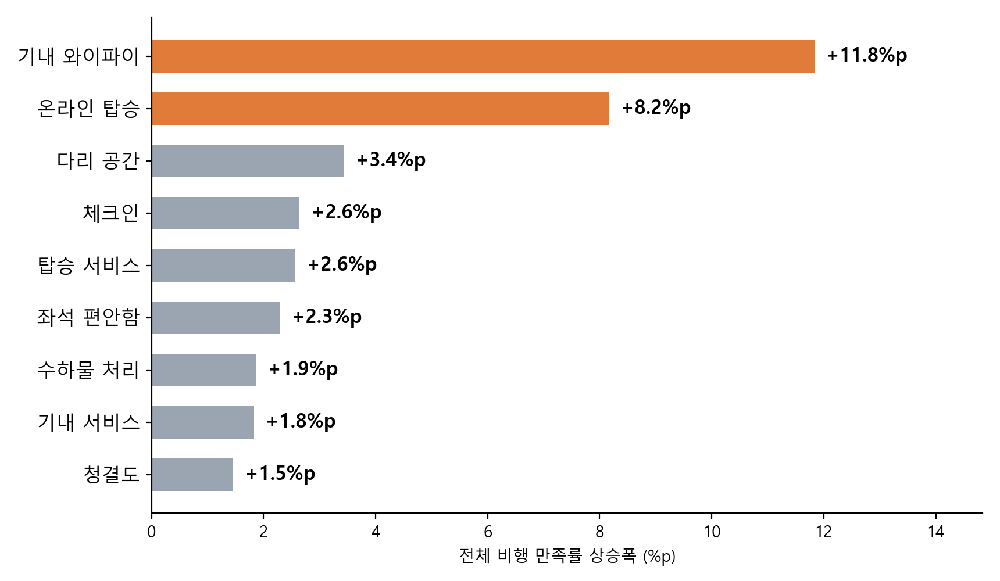
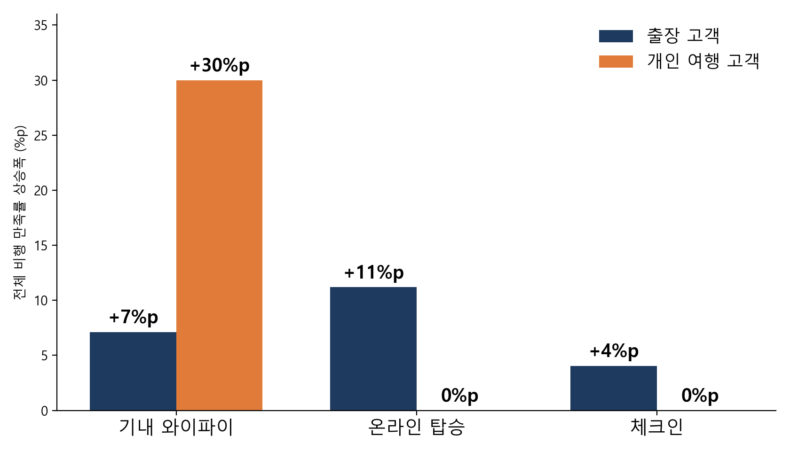

# 항공 승객 만족도 분석

**질문**: 한정된 예산에서 어떤 서비스부터 개선해야 전체 비행 만족률이 가장 많이 오르는가?

**데이터**: Kaggle 항공 승객 만족도 설문 (승객 103,904명 × 24개 컬럼, 서비스 평가 14개 항목은 0~5점)

**방법**: 서비스 평가를 "4점 이상 여부"로 바꿔 로지스틱 회귀로 추정하고, 서비스별로 4점 미만 → 4점 이상 개선 시 전체 비행 만족률 상승폭(%p)을 비교

## 핵심 결과

| 순위 | 서비스 | 개선 시 전체 비행 만족률 상승폭 |
|---|---|---|
| 1 | 기내 와이파이 | +11.8%p |
| 2 | 온라인 탑승 | +8.2%p |
| 3 | 다리 공간 | +3.4%p |
| 4 | 체크인 | +2.6%p |

- 현재 전체 비행 만족률은 43.3%. 음식·게이트 위치는 영향이 거의 없음
- **와이파이와 온라인 탑승을 전체 승객 대상으로 우선 개선**
- 승객 유형별 확인: 와이파이는 출장(+7%p)·개인 여행(+30%p) 모두 상승, 온라인 탑승·체크인은 출장 승객에서만 상승
- 모델 성능(검증 데이터): 정확도 89.3%, AUC 0.943 (4점 기준 적용 전 87.7%, 0.928)




## 분석 흐름

1. **전처리**: 도착 지연 결측 310건은 출발 지연 기반 회귀로 대체, 비행 거리 이상치는 IQR 기준 보정, 중복 정보 변수(VIF 14.9)인 도착 지연 제외
2. **기준 설정**: 서비스 점수가 3점 → 4점이 될 때 전체 비행 만족률이 급증 (와이파이 25% → 60%) → "4점 미만 vs 4점 이상"
3. **모델**: 로지스틱 회귀. 승객 유형을 고정한 상태에서 서비스별 효과를 비교하고, 계수를 만족률 상승폭(%p)으로 변환
4. **추가 확인**: 출장 / 개인 여행 승객군으로 나눠 같은 분석 반복

## 결과물

| 파일 | 내용 |
|---|---|
| [항공_만족도_분석_포트폴리오.pptx](항공_만족도_분석_포트폴리오.pptx) | 발표 자료 (13장) |
| [tableau/airline_dashboard.html](tableau/airline_dashboard.html) | HTML 대시보드: 핵심 결과 · 개선 시뮬레이터 · 데이터 탐색 (파일을 내려받아 브라우저로 열기) |
| [tableau/TABLEAU_GUIDE.md](tableau/TABLEAU_GUIDE.md) | Tableau 대시보드 제작 가이드와 데이터 (CSV) |
| [airline.ipynb](airline.ipynb) | 최초 분석 노트북 |
| [NOTEBOOK_REPORT.md](NOTEBOOK_REPORT.md) | 노트북 전체 출력 기록 |

## 폴더 구조

```
code/      재현 스크립트 (번호 순서대로 실행)
charts/    발표 자료·대시보드에 쓴 차트와 수치
tableau/   대시보드 HTML, Tableau용 집계 CSV, 제작 가이드
```

## 재현 방법

1. Kaggle에서 데이터(`train.csv`)를 받아 `code/01_analysis.py` 등의 경로(`C:/Users/TS/Downloads/archive/train.csv`)를 본인 경로로 수정
2. `01_analysis.py` → `02_service_lift.py` → `03_charts.py` → `03b_segment_chart.py` → `04_tableau_data.py` → `05_build_dashboard.py` 순서로 실행 (작업 폴더는 `code/`)
3. 필요 라이브러리: pandas, numpy, statsmodels, scikit-learn, matplotlib, python-pptx (`06_build_deck.py`)

## 한계

- 설문 상관 분석이므로 인과 효과는 시범 적용(A/B)으로 확인 필요
- 평가 점수 0(해당없음)을 낮은 점수와 동일하게 처리
- 개선 비용 데이터가 없어 ROI 우선순위는 산출하지 못함
- 여러 서비스를 동시에 개선한 예측값은 모델이 학습 범위를 벗어난 외삽이라 실제보다 크게 나올 수 있음
